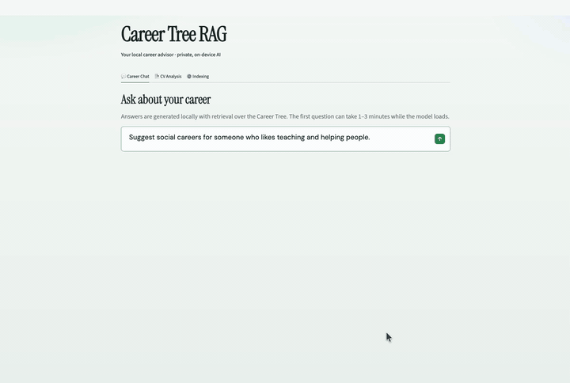

# Career Tree RAG (local)

Are you feeling lost in the world of AI? This is a local career-exploration RAG project, which can help you find your career path. We meticulously designed career tree ourselves which you can check from [https://www.ibz04.pro/blog/career-tree](https://www.ibz04.pro/blog/career-tree).



---

## Requirements

- Python 3.11+
- [Foundry Local](https://learn.microsoft.com/azure/ai-foundry/foundry-local/) (for chat and CV analysis; not needed for indexing)
- Network once to download the embedding model and Foundry model

## Quick start

```bash
git clone <repo-url>
cd Lost   # or your local folder name

chmod +x setup.sh index.sh ask.sh retrieve.sh regenerate.sh recommend.sh ui.sh _env.sh
./setup.sh
./index.sh
./ui.sh             # http://127.0.0.1:8501
# or: ./ask.sh --interactive
```

Scripts activate the venv themselves via `_env.sh`.

## What each command does


| Command                        | Purpose                                                                                              |
| ------------------------------ | ---------------------------------------------------------------------------------------------------- |
| `./setup.sh`                   | Create venv and install dependencies                                                                 |
| `./index.sh`                   | Build the search index (required before asking)                                                      |
| `./ui.sh`                      | Open the Streamlit UI                                                                                |
| `./ask.sh "…"`                 | Ask a question in the terminal                                                                       |
| `./recommend.sh --cv path.pdf` | Analyze a CV                                                                                         |
| `./retrieve.sh "…"`            | Search only (no LLM)                                                                                 |
| `./regenerate.sh`              | Re-download the career tree from the website (**overwrites** local edits to `data/career-tree.json`) |


## UI

1. **Career Chat** — ask career questions
2. **CV Analysis** — upload a CV → structured JSON
3. **Indexing** — rebuild the search index

First chat answer can take 1–3 minutes while the local model loads.

## Models


| Model              | Role                                                                              |
| ------------------ | --------------------------------------------------------------------------------- |
| `all-MiniLM-L6-v2` | Embeddings (Hugging Face)                                                         |
| `qwen2.5-0.5b`     | Default local LLM (Foundry). Small/fast; use `--model <alias>` for a stronger one |


## Add content

- **Articles:** put `.md` files in `content/extra/`, then `./index.sh`
- **Career roles:** edit `data/career-tree.json`, then `./index.sh` (do **not** run `./regenerate.sh` after that, or your edits will be wiped)


## Notes

- Venv and Chroma live under `~/.career_tree_rag/` (avoids iCloud Desktop freezes)
- CV parsing stays local; cache is in `data/cv_cache/` (gitignored)
- License: MIT — see `[LICENSE](LICENSE)`

